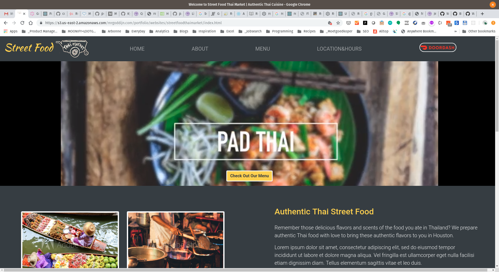

# Website Redesign for StreetFood ThaiMarket

## About StreetFood ThaiMarket
StreetFood ThaiMarket is a rare little gem in Houston (TX), a combination of a Thai food restaurant and a Thai supermarket, 
where they serve authentic Thai food. Nowadays it is very hard to find an authentic restaurant where they don't Westernize the 
flavors too much.

## About this redesign
As part of the immersive coding bootcamp, one of our assignments was to redesign a website of a restaurant of choice. Since I love Thai food and this restaurant, I decided to work on [streetfoodthaimarket.com](https://streetfoodthaimarket.com)

## Starting point
This is a screenshot of their website at the time of the assignment, in end of April 2019,

## Redesigned website

